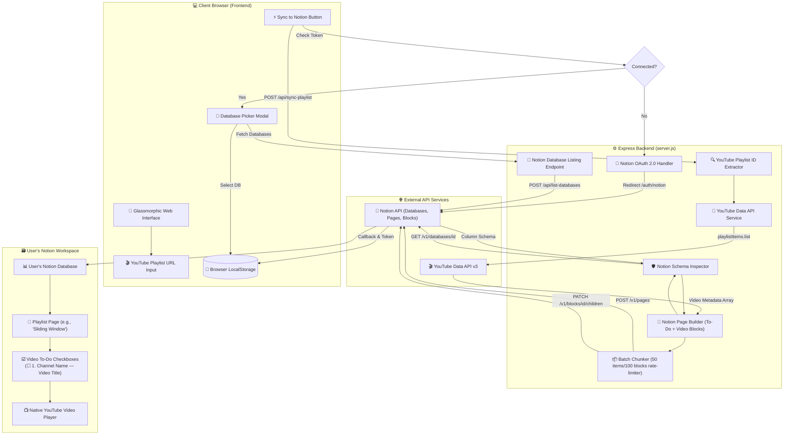

# Y2N — YouTube to Notion Playlist Tracker 🎬 ➡️ 📝

> Turn YouTube playlists into trackable Notion database pages with clean to-do checkboxes, bold channel names, direct video links, and embedded native video players.

---

## 🏗️ System Architecture & Data Flow



---

## ✨ Features

- ⚡ **Zero-Friction OAuth Flow** — 1-click Notion connection with an interactive database picker modal. No manual API keys or database IDs required from end-users!
- 📺 **Native Embedded Video Players** — Each video item includes an embedded YouTube video player block right inside the to-do item so you can watch without leaving Notion!
- ☑️ **Trackable To-Do Checkboxes** — Organized format: `☐ 1. Channel Name — Video Title` with bold channel text and blue hyperlinked video title.
- 🛡️ **Dynamic Schema Inspector** — Automatically detects existing database properties (`Title`, `Number`, `Status`/`Select`) and adapts gracefully to any database structure without crashing.
- 📦 **Smart Batch Chunking** — Automatically chunks large playlists into 50-item batches to comply with Notion API block limits.
- 🎨 **Premium Dark Glassmorphism UI** — Animated background particles, smooth hover effects, micro-interactions, and instant notifications.

---

## 🗃️ How It Looks in Notion

```text
Your Notion Database
├── Backtracking                          | #1 | Not started
├── Sliding Window Algorithm              | #2 | Not started
└── ...
```

Inside each playlist page:
```text
☐ 1. Aditya Verma — Sliding Window Introduction Identification And Types
   ┌────────────────────────────────────────────────────────┐
   │ 🎬 Native YouTube Video Player                         │
   │    [▶ Play Video]                                      │
   └────────────────────────────────────────────────────────┘

☐ 2. Aditya Verma — Sliding Window Problems
   ┌────────────────────────────────────────────────────────┐
   │ 🎬 Native YouTube Video Player                         │
   │    [▶ Play Video]                                      │
   └────────────────────────────────────────────────────────┘
```

---

## 🚀 Quick Start (Local Setup)

### 1. Prerequisites

- [Node.js](https://nodejs.org/) (v18+)
- A [Google Cloud YouTube Data API v3 Key](https://console.cloud.google.com/apis/credentials)
- A [Notion Public Integration](https://www.notion.so/profile/integrations) (OAuth Client ID & Secret)

### 2. Installation

```bash
# Clone repository
git clone https://github.com/tingirikar/Y2N.git
cd Y2N

# Install dependencies
npm install
```

### 3. Environment Setup

Create a `.env` file in the root directory:

```env
YOUTUBE_API_KEY=your_youtube_api_key
NOTION_CLIENT_ID=your_notion_client_id
NOTION_CLIENT_SECRET=your_notion_client_secret
PORT=3000
```

### 4. Run Locally

```bash
# Start development server
npm run dev
```

Open `http://localhost:3000` in your browser!

---

## 🌐 Deploy to Render.com

Deploy Y2N live on Render in 4 simple steps:

1. **Push code to GitHub**:
   ```bash
   git push origin main
   ```
2. **Create Web Service on Render**:
   - **Build Command**: `npm install`
   - **Start Command**: `npm start`
3. **Set Environment Variables on Render**:
   - `YOUTUBE_API_KEY`
   - `NOTION_CLIENT_ID`
   - `NOTION_CLIENT_SECRET`
   - `OAUTH_REDIRECT_URI` = `https://<your-app-name>.onrender.com/auth/notion/callback`
4. **Add Redirect URI in Notion**:
   - Add `https://<your-app-name>.onrender.com/auth/notion/callback` to your Notion Integration Redirect URIs.

---

## 📁 Project Structure

```text
Y2N/
├── server.js          # Express backend (YouTube Data API + Notion OAuth & API integration)
├── package.json       # Project configuration & scripts
├── .env.example       # Template for environment variables
├── README.md          # Complete project documentation & architecture diagram
└── public/
    ├── index.html     # Responsive single-page application & database picker modal
    ├── style.css      # Dark theme glassmorphism styling
    └── app.js         # Client-side OAuth-first flow logic & API integration
```

---

## 📜 License

Distributed under the MIT License. Built with ❤️ by Y2N.
