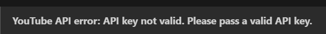

to fix these follow these steps:
step1 : go to google console cloud, credentiaals
step2 : if there are no credentials => u might have deleted api key, go to market place, search youtube
step3 : select youtube data api v3, and enable it.
step4 : go back to credentials and create credentials
select the youtube v3 api key, thats it

to update it on render
step1 : go to dashboard.onrender.com
step2 : select Y2N service
step3 : on the left click on environment
step4 : click on edit and update required key
